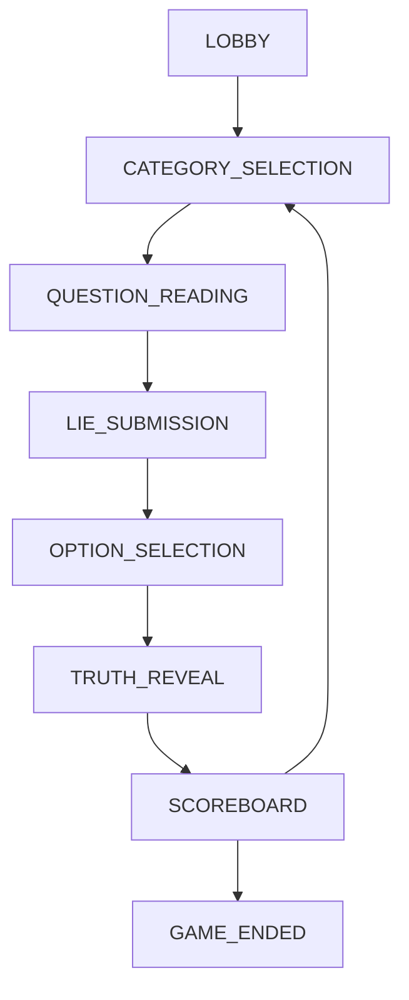

# Development Guide

This guide provides detailed technical information for developers working on the Lie-Ability game.

## 🏗️ Architecture Overview

### Backend Architecture

The backend follows a modular architecture with clear separation of concerns:

```
src/
├── models/           # Data models and business logic
│   ├── Game.js      # Game state machine and core logic
│   └── Player.js    # Player data and avatar management
├── services/         # Business services
│   ├── TimerService.js    # Timer management with cleanup
│   └── QuestionService.js # Question pack loading and validation
├── utils/           # Utilities and constants
│   └── constants.js # Game configuration constants
└── server.js        # Express server and Socket.IO setup
```

#### Key Components

**Game.js** - Central game state machine
- Manages all game states (lobby, category_selection, lie_submission, etc.)
- Handles player actions and state transitions
- Manages timers and auto-progression
- Broadcasts updates to all connected clients

**Player.js** - Player data management
- Stores player information (name, avatar, points, status)
- Tracks submission states (hasSubmittedLie, hasSelectedOption)
- Handles reconnection and disconnection logic

**TimerService.js** - Timer management
- Creates and manages countdown timers
- Provides cleanup to prevent memory leaks
- Supports timer cancellation and remaining time queries

**QuestionService.js** - Question pack management
- Loads and validates question pack JSON files
- Provides random question selection with category filtering
- Manages used questions to prevent repeats

### Frontend Architecture

The frontend uses modern Svelte with a component-based architecture:

```
svelte/src/
├── Host.svelte           # Main host screen
├── Player.svelte         # Main player screen
└── components/
    ├── Lobby.svelte      # Lobby/waiting screen
    ├── QuestionView.svelte    # Question display
    ├── CategoryView.svelte    # Category selection
    ├── OptionsView.svelte     # Option voting
    ├── RevealView.svelte      # Truth reveal and scoring
    ├── Scoreboard.svelte      # Score display
    └── player/               # Player-specific components
        ├── PlayerJoin.svelte         # Name/avatar selection
        ├── PlayerCategorySelect.svelte # Category selection
        ├── PlayerLieSubmit.svelte     # Lie submission
        ├── PlayerOptionSelect.svelte  # Option voting
        ├── PlayerResults.svelte       # Personal results
        └── PlayerStatus.svelte        # Connection status bar
```

#### State Management

- **Reactive Variables**: Svelte's reactive statements (`$:`) handle state updates
- **WebSocket Events**: Real-time updates via Socket.IO client
- **Component Props**: Data flows down through component hierarchy
- **Event Dispatching**: Child components emit events to parent components

## 🔄 Game State Machine

The game follows a strict state machine with these states:

1. **LOBBY** - Players join and wait
2. **CATEGORY_SELECTION** - Random player chooses category (15s)
3. **QUESTION_READING** - Question displayed (10s)
4. **LIE_SUBMISSION** - Players submit lies (30s)
5. **OPTION_SELECTION** - Players vote on options (30s)
6. **TRUTH_REVEAL** - Scoring and lie attribution (5s per lie)
7. **SCOREBOARD** - Score display (10s)

### State Transitions



### Timer Management

Each timed phase has:
- **Main timer**: Auto-advances when time expires
- **Progress callback**: Updates sent to clients every second
- **Early completion**: Advances when all players complete action
- **Cleanup**: Timers cancelled when manually advancing

## 🌐 WebSocket Communication

### Connection Flow

1. **Client connects** to Socket.IO server
2. **Player joins** with `join_game` event (name + avatar)
3. **Server validates** and responds with `player_joined_response`
4. **State sync** happens via `game_state_update` and `sub_step_info`
5. **Real-time updates** keep all clients synchronized

### Event Structure

#### Client → Server Events
```javascript
// Join game
socket.emit('join_game', {
  name: 'PlayerName',
  avatar: { emoji: '😀', color: '#667eea' }
})

// Submit lie
socket.emit('submit_lie', { lie: 'Fake answer' })

// Vote for option
socket.emit('select_option', { optionId: 2 })

// Select category
socket.emit('select_category', { categoryId: 1 })
```

#### Server → Client Events
```javascript
// Game state updates
socket.on('game_state_update', (gameState) => {
  // gameState contains: state, players, currentRound, etc.
})

// Player-specific state
socket.on('sub_step_info', (subStep) => {
  // subStep contains: hasSubmittedLie, hasSelectedOption, categories, options, etc.
})

// Timer updates
socket.on('timer_update', (timer) => {
  // timer contains: type, secondsRemaining
})
```

### Broadcasting Strategy

- **Game state changes**: Broadcast to all connected clients
- **Player-specific data**: Send targeted events to individual players
- **Host-specific data**: Separate events for host screen vs player devices
- **Observer support**: Host screen receives all data even without joining as player

## 🎮 Game Logic Details

### Lie Processing

1. **Collection**: All player lies collected during submission phase
2. **Deduplication**: Identical lies combined and credited to all submitters
3. **Padding**: Extra lies added from question pack to hide patterns
4. **Shuffling**: All options (lies + truth) randomly ordered
5. **Filtering**: Players can't see their own lies as options

### Scoring Algorithm

```javascript
// Points per round
const POINTS = {
  ROUND_1: { FOOL_PLAYER: 500, FIND_TRUTH: 1000 },
  ROUND_2: { FOOL_PLAYER: 1000, FIND_TRUTH: 2000 },
  ROUND_3: { FOOL_PLAYER: 1500, FIND_TRUTH: 3000 }
}

// Scoring logic
playersFooled = votes_for_player_lie.length
truthFinders = votes_for_correct_answer.length

playerScore += playersFooled * POINTS[round].FOOL_PLAYER
if (playerVotedCorrectly) {
  playerScore += POINTS[round].FIND_TRUTH
}
```

### Auto-Progression

When timers expire:
- **Category Selection**: Random category automatically selected
- **Lie Submission**: Random lies submitted for inactive players
- **Option Selection**: Random options selected for inactive players
- **Reconnection**: Players can rejoin and resume from current state

## 🧪 Testing Strategy

### Manual Testing with Debug Interface

The debug interface (`/tests/debug-interface.html`) provides:

```html
<!-- Connection testing -->
<div id="connection-status">Connected/Disconnected</div>

<!-- Player simulation -->
<input id="player-name" placeholder="Player name">
<button onclick="joinGame()">Join Game</button>

<!-- Game actions -->
<button onclick="startGame()">Start Game</button>
<button onclick="submitLie()">Submit Lie</button>
<button onclick="selectOption()">Vote</button>

<!-- Real-time event log -->
<div id="event-log"></div>
```

### Multi-Tab Testing

1. Open multiple browser tabs to debug interface
2. Join with different names in each tab
3. Test full game flow with multiple players
4. Verify state synchronization across all tabs

### Edge Case Testing

- **Disconnections**: Players leaving mid-game
- **Timeouts**: What happens when timers expire
- **Duplicates**: Multiple players submitting same lie
- **Empty submissions**: Players not submitting anything
- **Reconnections**: Players rejoining after disconnect

## 🔧 Development Workflow

### Frontend Development

```bash
cd svelte
npm run dev    # Start Vite dev server on port 5173
```

This provides:
- **Hot module replacement**: Changes appear instantly
- **Error overlay**: Compile errors shown in browser
- **Source maps**: Debug original Svelte code
- **Fast builds**: Vite's optimized bundling

### Backend Development

```bash
npm run dev    # Start with nodemon for auto-restart
```

Features:
- **Auto-restart**: Server restarts on file changes
- **Debug logging**: Detailed console output
- **Error handling**: Graceful error recovery

### Build Process

```bash
cd svelte && npm run build && cd ..
```

This creates optimized bundles in `public/assets/`:
- **Minified JavaScript**: Reduced file sizes
- **CSS extraction**: Separate stylesheet files
- **Asset hashing**: Cache-busting filenames
- **Source maps**: For production debugging

### Adding New Features

1. **Backend changes**:
   - Add new event handlers in `server.js`
   - Update game logic in `Game.js` or `Player.js`
   - Add new constants in `constants.js`

2. **Frontend changes**:
   - Create new Svelte components in appropriate directories
   - Add event listeners and emit events to backend
   - Update state management and reactive variables

3. **Testing**:
   - Test with debug interface
   - Verify multi-player scenarios
   - Check edge cases and error handling

## 📊 Performance Considerations

### Memory Management

- **Timer cleanup**: All timers properly cancelled
- **Event listener cleanup**: Socket listeners removed on disconnect
- **Object references**: No circular references in game state

### Network Optimization

- **Selective updates**: Only send changed data, not full state
- **Batch operations**: Group related updates together
- **Compression**: Socket.IO handles automatic compression

### Scalability Limitations

Current architecture supports:
- **Single game instance**: One game per server
- **16 players maximum**: Configurable in constants
- **No persistence**: Game state lost on restart
- **Memory-based storage**: All data in server memory

### Future Optimization Ideas

- **Room system**: Multiple concurrent games
- **Database persistence**: Save game history
- **Redis scaling**: Multi-server deployment
- **Player reconnection**: Persistent player sessions

## 🚀 Deployment

### Production Build

```bash
# Install dependencies
npm install
cd svelte && npm install && cd ..

# Build frontend
cd svelte && npm run build && cd ..

# Start production server
npm start
```

### Environment Variables

```bash
PORT=3000              # Server port (default: 3000)
PUBLIC_URL=https://...  # Override auto-detected URL
NODE_ENV=production    # Production mode
```

### Docker Deployment

```dockerfile
FROM node:18-alpine
WORKDIR /app

# Install backend dependencies
COPY package*.json ./
RUN npm ci --only=production

# Install frontend dependencies and build
COPY svelte/package*.json ./svelte/
WORKDIR /app/svelte
RUN npm ci && npm run build

# Copy source and start
WORKDIR /app
COPY . .
EXPOSE 3000
CMD ["npm", "start"]
```

### Reverse Proxy Configuration

For production deployment behind nginx:

```nginx
upstream lie-ability {
    server localhost:3000;
}

server {
    listen 80;
    server_name yourdomain.com;

    location / {
        proxy_pass http://lie-ability;
        proxy_http_version 1.1;
        proxy_set_header Upgrade $http_upgrade;
        proxy_set_header Connection 'upgrade';
        proxy_set_header Host $host;
        proxy_set_header X-Real-IP $remote_addr;
        proxy_set_header X-Forwarded-For $proxy_add_x_forwarded_for;
        proxy_set_header X-Forwarded-Proto $scheme;
        proxy_cache_bypass $http_upgrade;
    }
}
```

## 🐛 Common Issues & Solutions

### "Connection timeout" on player join
- **Cause**: Field name mismatch between client and server
- **Solution**: Ensure client sends correct event format
- **Fixed in**: Recent commits aligned event structures

### Game stuck on "time to lie"
- **Cause**: State sync issues between client and server
- **Solution**: Fixed field names (hasSubmitted → hasSubmittedLie)
- **Prevention**: Always broadcast state after player actions

### Categories showing as "undefined"
- **Cause**: Server sending wrong field names to client
- **Solution**: Map category data correctly in getSubStepInfo
- **Added**: Category emoji mapping for better UX

### Port already in use
- **Cause**: Previous server process still running
- **Solution**: Kill existing process or use different port
- **Tool**: `start.sh` automatically handles port conflicts

---

This development guide should help you understand the codebase structure and contribute effectively to the project!